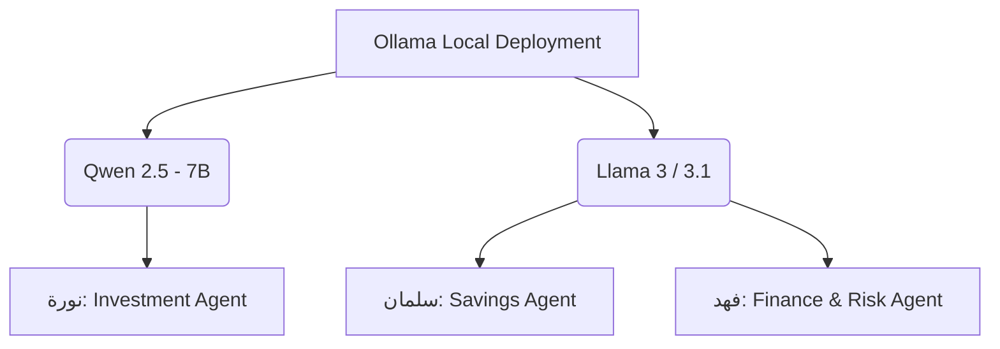

# 💼 مجلس أمد للوعي المالي — AMD Financial Council
### 🤖 On-Premise Hybrid Multi-Agent Social FinTech Platform

نظام وكلاء ذكاء اصطناعي متعدد (**Multi-Agent**) يحاكي مجلساً استشارياً مالياً مكوّناً من ثلاثة مستشارين متخصصين، يعمل **بالكامل محلياً (On-Premise)** من داخل بنك الإنماء دون أي اعتماد على واجهات برمجة تطبيقات سحابية — لضمان أعلى مستوى ممكن من الخصوصية وحماية البيانات المالية الحساسة للمستخدم وامتثالاً لتشريعات **ساما (SAMA)** وسدايا.

---

## 1. لمحة عن المشروع ومعمارية النماذج الهجينة

يقدّم "مجلس أمد" تجربة مشورة مالية متكاملة وتنافسية (**Holistic View**) عبر ثلاث شخصيات ذكاء اصطناعي متخصصة تتناقش فيما بينها ومع المستخدم الفردي أو أعضاء القروب (مثل قروبات السفر أو شراء السيارة).

لتحقيق كفاءة استثنائية، يطبق المشروع مبدأ **"النموذج الأنسب للمهمة الأنسب" (Right Model for the Right Job)** عبر دمج عائلتين من النماذج مفتوحة المصدر محلياً ويتم تشغيلها وإدارتها بالكامل عبر **Ollama**:



### 🎯 توزيع أدوار الوكلاء (Agent Specialization)

| الوكيل | التخصص | النموذج اللغوي | الدور والمسؤولية المالية وسبب الاختيار |
| --- | --- | --- | --- |
| سلمان 🟢 | المخطط المالي | Llama-3 (8B) | هيكلة ميزانية الرواتب، خطط الادخار، وتوقعات الفائض لـ 12 شهراً. تم اختياره لتفوق النموذج في الحوار وسلاسته المنطقية. |
| نورة 🔵 | مستشار الاستثمار | Qwen2.5-7B | تحليل الأسواق الفورية والأسهم والصناديق الاستثمارية. تم اختيار Qwen لتفوقه الرياضي الحاسم ودقته العالية في استدعاء الأدوات (Tool Calling). |
| فهد 🟠 | خبير السلوك والتمويل | Llama-3 (8B) | حاسبات التمويل المرن، تقييم المخاطر الائتمانية، والالتزام الذاتي ومتابعة سياق نقاش المجموعات الطويل. |

### 💡 لماذا معمارية محلية 100%؟

خلافاً للحلول التقليدية المعتمدة على مزوّدي استدلال سحابيين، يعتمد هذا النظام **حصراً** على مكوّنات تُشغَّل داخل البنية التحتية الخاصة بالبنك، بحيث لا تغادر أي بيانات مالية للمستخدم الشبكة المحلية أبداً وبأقل زمن استجابة (**Low Latency**) وبتكلفة تشغيلية منعدمة (**Zero Cost**).

### التقنيات الأساسية

* **[Ollama](https://ollama.com)** — محرك استدلال محلي بالكامل يستبدل أي اتصال بواجهات برمجة تطبيقات سحابية للدردشة وتوليد الأجوبة.
* **[LangGraph](https://langchain-ai.github.io/langgraph/)** — يدير سير عمل المجلس عبر **توجيه ديناميكي متسلسل (Sequential Dynamic Routing)**: كل وكيل عقدة مستقلة تُنفَّذ بالتتابع وتقرر بنفسها دخولياً هل السؤال ضمن تخصصها أم تتجاوزه للوكيل التالي.
* **[ChromaDB](https://www.trychroma.com/)** — قاعدة بيانات متجهة محلية تُشغّل نظام **RAG مستقل متعدد المسارات (Segregated RAG)** يربط كل وكيل بقاعدة معرفة مستقلة لمنع تسرّب السياقات.
* **صندوق أدوات آمن (Secure Sandbox) + بوابة أمان (Gateway Proxy)** — أدوات معزولة (الربط الموحد مع الإنماء كابيتال لقراءة الأسعار والتنفيذ، الربط مع سمة، وتصنيف المصاريف) تمر استجاباتها إلزامياً عبر طبقة Middleware تُنقّح (Anonymize) البيانات الحساسة قبل خروجها للوكيل.

### ⚠️ مبدأ معماري مهم: لا رفع ملفات من المستخدم

المستخدم النهائي يتفاعل عبر **الدردشة النصية فقط**. تغذية قواعد المعرفة (RAG) بملفات PDF هي مهمة إدارية يقوم بها المطوّر (Backend Admin) حصراً عبر سكريبت مستقل (`ingest_data.py`)، بمعزل تام عن دورة حياة الدردشة الحية.

---

## 2. هيكل الملفات | Project Structure

```text
amd-council/
├── agents/
│   ├── __init__.py
│   └── prompts.py
├── chroma_store/
├── data/
│   ├── behavior_docs/
│   ├── planner_docs/
│   └── risk_docs/
├── public/
│   ├── app.js
│   ├── index.html
│   └── style.css
├── sandbox/
│   ├── __init__.py
│   └── tools.py
├── .env.example
├── .gitignore
├── ingest_data.py
├── rag_engine.py
├── requirements.txt
└── server.py

```

### 📋 دليل وظائف الملفات والمجلدات

| الملف أو المجلد | النوع | الوصف والوظيفة التقنية |
| --- | --- | --- |
| server.py | ملف تنفيذي | الخادم الرئيسي (FastAPI) لإدارة سير عمل الوكلاء وبث الردود وكروت التصويت عبر SSE. |
| rag_engine.py | ملف تنفيذي | محرك الاسترجاع؛ يحول المدخلات لمتجهات رقمية ويستعلم في مسار ChromaDB المعزول لكل وكيل. |
| ingest_data.py | سكريبت إداري | سكريبت للمطور لقراءة اللوائح والأنظمة (PDF) وتقسيمها وتوليد المتجهات الرقمية لحفظها. |
| agents/prompts.py | مجلد برمجي | يحتوي على الـ System Prompts وقواعد امتثال SAMA/CMA وتوزيع مهام النماذج الهجينة. |
| sandbox/tools.py | بيئة الأدوات | يحتوي على أدوات الـ Tool Calling للربط الموحد مع الإنماء كابيتال والاستعلام من سمة. |
| public/ | واجهة المستخدم | مجلد الواجهة الأمامية (HTML/JS/CSS) المصمم بهوية مصرف الإنماء لدعم الحوكمة والتفاعل. |
| data/ | مستندات المعرفة | المجلد الرئيسي لتخزين ملفات الـ PDF التشريعية والمالية مقسمة حسب تخصص كل مستشار. |
| chroma_store/ | قاعدة بيانات | المخزن الرقمي المتجهي لـ ChromaDB والذي يولد تلقائياً بعد تشغيل محرك البيانات. |
| requirements.txt | ملف تكوين | يحتوي على كافة المكتبات والاعتماديات اللازمة للتشغيل المحلي بالكامل دون أي متطلبات سحابية. |

---

## 3. دليل التثبيت والتشغيل المتسلسل

> **المتطلبات الأساسية:** Python 3.10+، ومنصة [Ollama](https://ollama.com) مثبتة محلياً على الجهاز أو الخادم.

### الخطوة 1 — تثبيت الاعتماديات

```bash
# إنشاء بيئة افتراضية وتفعيلها
python3 -m venv .venv
source .venv/bin/activate        # على Windows: .venv\Scripts\activate

# تثبيت كل الاعتماديات
pip install -r requirements.txt

```

### الخطوة 2 — تشغيل خادم Ollama وتنزيل النماذج المطلوبة

```bash
# شغّل خادم Ollama (في نافذة طرفية منفصلة لتظل تعمل في الخلفية)
ollama serve

# في نافذة طرفية أخرى: نزّل النماذج المحددة بالمعمارية الهجينة للمجلس
ollama pull qwen2.5:7b
ollama pull llama3
ollama pull nomic-embed-text

```

تأكد أن الخادم يستجيب قبل المتابعة:

```bash
curl http://localhost:11434/api/tags

```

### الخطوة 3 — إعداد متغيرات البيئة (اختياري)

```bash
cp .env.example .env
# عدّل القيم داخل .env إذا لزم الأمر

```

### الخطوة 4 — تغذية قواعد المعرفة (RAG)

ضع ملفات PDF الخاصة بكل تخصص داخل المجلد المناسب:

```text
data/planner_docs/   ← أدلة الميزانية، خطط الادخار للعملاء...
data/risk_docs/      ← لوائح CMA، أنظمة الصناديق وعوائد الإنماء كابيتال...
data/behavior_docs/  ← لوائح SAMA للتمويل المسؤول، معايير سمة الائتمانية...

```

ثم شغّل سكريبت التغذية المعزول:

```bash
# يغذي المسارات الثلاثة دفعة واحدة لمنع تداخل السياقات
python ingest_data.py

# أو لتغذية مسار واحد فقط (مثلاً بعد إضافة ملف جديد لنورة)
python ingest_data.py --agent risk

# لمسح مجموعة معينة وإعادة تغذيتها من الصفر بدل الإضافة التراكمية
python ingest_data.py --agent planner --reset

```

> إذا لم تُغذَّ إحدى القواعد بعد، يعمل النظام بشكل طبيعي؛ ويعتمد الوكيل المعني على معرفته العامة فقط مع التنبيه لذلك ضمنياً في رده.

### الخطوة 5 — تشغيل الخادم الرئيسي

```bash
# تشغيل الخادم الخلفي المربوط ببوابات البنك والإنماء كابيتال
python server.py
# أو عبر uvicorn مباشرة مع إعادة التحميل التلقائي أثناء التطوير:
uvicorn server:app --host 0.0.0.0 --port 3000 --reload

```

افتح المتصفح مباشرة على: `http://localhost:3000`

### الخطوة 6 — التحقق من صحة الإعداد

```bash
curl http://localhost:3000/api/health

```

يعرض هذا المسار حالة الاتصال بـ Ollama وحالة كل قاعدة معرفة RAG (عدد المقاطع المخزّنة) للتأكد من جاهزية النظام للاستخدام الفعلي.

---

## ملاحظات ختامية

* كل الاستدلال (محادثة + تقييم توجيه + تضمين RAG) يمر عبر خوادم Ollama المحلية فقط لضمان الأمن والامتثال الكامل.
* الأداة الاستثمارية متصلة برابط موحد ومباشر مع **الإنماء كابيتال** لقراءة الأسعار الفورية وتحديث المحافظ بشكل آمن ومطابق تماماً.
* هذا النظام يقدّم معلومات لإدارة الوعي المالي والمشورة التعليمية والتشاركية؛ وكافة التوصيات مصممة للامتثال لضوابط التمويل المسؤول (راجع `COMPLIANCE_RULES` في `agents/prompts.py`).

```
---

```
